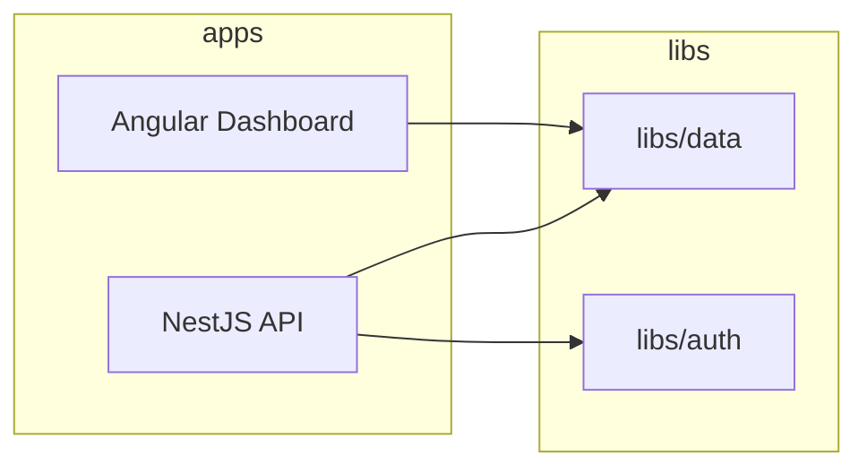
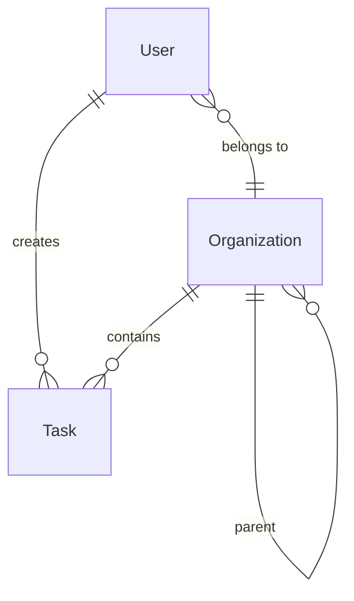

# Secure Task Management System

A secure Task Management System with role-based access control (RBAC) in an NX monorepo. Backend: NestJS + TypeORM + PostgreSQL. Frontend: Angular + TailwindCSS.

**Repository naming:** Use the pattern `{firstLetterOfFirstName}{lastName}-{uuid}` (e.g. `jdoe-0a19fc14-d0eb-42ed-850d-63023568a3e3`). Document your chosen name here when applicable.

---

## Setup Instructions

### Prerequisites

- Node.js 18+
- Docker and Docker Compose
- npm

### 1. Install dependencies

```bash
cd secure-task
npm install --legacy-peer-deps
```

### 2. Environment configuration

Copy the example env and set values:

```bash
cp .env.example .env
```

Edit `.env`:

- **DATABASE_URL** – PostgreSQL connection string (default from `.env.example` matches docker-compose).
- **JWT_SECRET** – Secret for signing JWTs (use a strong value in production).
- **JWT_EXPIRES_IN** – Optional; default `7d`.
- **AUDIT_LOG_PATH** – Optional; if set, audit logs are written to this file; otherwise they go to the console.

### 3. Start PostgreSQL

```bash
npm run docker:up
```

Wait for the DB to be ready (e.g. a few seconds), then start the API.

### 4. Run backend and frontend

**Terminal 1 – API:**

```bash
npm run serve:api
```

API runs at `http://localhost:3000` with global prefix `/api` (e.g. `http://localhost:3000/api/auth/login`).

**Terminal 2 – Dashboard:**

```bash
npm run serve:dashboard
```

Dashboard runs at `http://localhost:4200` and proxies `/api` to the backend.

### 5. Demo users and Create account

After the API starts, seed creates:

| Email | Password | Role |
|-------|----------|------|
| `admin@example.com` | `admin123` | Owner |
| `admin2@example.com` | `admin123` | Admin |
| `viewer@example.com` | `admin123` | Viewer |

Use these to test RBAC: log in as each role and verify permissions (e.g. Viewer cannot create tasks or view audit log).

**Create account (demo):** Go to `/register` to create new users with any role. For testing RBAC only; not intended for production.

**Bonus features:**
- **Task completion chart** – Bar chart on the tasks page showing Todo, In Progress, and Done counts.
- **Dark/light mode** – Toggle in the header (when logged in) or floating button (on login/register). Preference is persisted.
- **Keyboard shortcuts** – Press `N` to create a new task, `Esc` to close modals.

### Commands summary

| Command | Description |
|--------|-------------|
| `npm run serve:api` | Start NestJS API |
| `npm run serve:dashboard` | Start Angular dashboard |
| `npm run docker:up` | Start PostgreSQL (Docker) |
| `npm run docker:down` | Stop PostgreSQL |
| `npm run test:api` | Run API unit tests |
| `npm run test:dashboard` | Run dashboard unit tests |
| `npm run build:api` | Build API |
| `npm run build:dashboard` | Build dashboard |

---

## Architecture Overview

### NX monorepo layout

- **apps/api** – NestJS backend (REST API, JWT auth, RBAC, TypeORM, audit logging).
- **apps/dashboard** – Angular SPA (TailwindCSS, NgRx Signal Store, task CRUD, login).
- **libs/data** – Shared TypeScript interfaces and DTOs (tasks, auth, audit) used by both api and dashboard.
- **libs/auth** – Reusable RBAC types and helpers: permissions, role–permission mapping, `hasPermission`; consumed by the API; decorators/guards live in the API.



### Rationale

- **libs/data** keeps API contracts and frontend types in sync and avoids duplication.
- **libs/auth** centralizes permission and role semantics; the API implements guards and decorators that use them.
- Apps stay thin and testable; shared logic lives in libs.

---

## Data Model

### Schema

- **users** – `id`, `email`, `passwordHash`, `role` (Owner | Admin | Viewer), `organizationId`, `createdAt`.
- **organizations** – `id`, `name`, `parentId` (nullable for 2-level hierarchy).
- **tasks** – `id`, `title`, `description`, `status`, `category`, `orderIndex`, `organizationId`, `createdByUserId`, `createdAt`, `updatedAt`.

Permissions are derived from role (no separate permissions table). Task visibility and mutations are scoped by the user’s organization and role.

### ERD (conceptual)



---

## Access Control Implementation

### Roles and permissions

- **Owner** – Full access in the org; can view audit log.
- **Admin** – Create/read/update/delete tasks in the org; can view audit log.
- **Viewer** – Read-only access to tasks in the org.

Role–permission mapping (in `libs/auth`):

- Owner, Admin: `task:create`, `task:read`, `task:update`, `task:delete`, `audit:read`.
- Viewer: `task:read` only.

### Organization hierarchy

Two-level: root organizations have `parentId = null`; children have `parentId` set. Tasks belong to one organization. Users belong to one organization. Access is scoped to the user’s organization (tasks in the same org only).

### JWT and RBAC

- Login (`POST /api/auth/login`) returns a JWT containing `sub`, `email`, `role`, `organizationId`.
- All non-public routes are protected by a global JWT guard.
- A **RolesGuard** and **PermissionsGuard** (and task ownership checks) enforce RBAC:
  - Task create: requires `task:create`; `organizationId` and `createdByUserId` set from JWT.
  - Task list: returns only tasks for the user’s org.
  - Task update/delete: requires `task:update` / `task:delete` and task in the same org.
  - Audit log: `GET /api/audit-log` requires Owner or Admin (`audit:read`).

Audit entries (login, task create/update/delete, audit-log read) are written to the console or to a file when `AUDIT_LOG_PATH` is set.

---

## API Documentation

Base URL (when running locally): `http://localhost:3000/api`.

| Method | Path | Auth | Description |
|--------|------|------|-------------|
| POST | /auth/login | No | Login; returns JWT and user. |
| POST | /auth/register | No | Demo: create account (email, password, role). Returns JWT. |
| POST | /tasks | JWT + task:create | Create task. |
| GET | /tasks | JWT + task:read | List tasks (scoped by org). Query: `sort`, `category`, `status`. |
| GET | /tasks/:id | JWT + task:read | Get one task (same org). |
| PUT | /tasks/:id | JWT + task:update | Update task (same org). |
| DELETE | /tasks/:id | JWT + task:delete | Delete task (same org). |
| GET | /audit-log | JWT + Owner/Admin | Paginated audit log. Query: `page`, `limit`. |

### Sample requests and responses

**Login**

```http
POST /api/auth/login
Content-Type: application/json

{"email":"admin@example.com","password":"admin123"}
```

```json
{
  "access_token": "eyJhbGciOiJIUzI1NiIs...",
  "user": {
    "id": "...",
    "email": "admin@example.com",
    "role": "Owner",
    "organizationId": "..."
  }
}
```

**Create task**

```http
POST /api/tasks
Authorization: Bearer <access_token>
Content-Type: application/json

{"title":"My task","description":"Optional","status":"Todo","category":"Work","orderIndex":0}
```

**List tasks**

```http
GET /api/tasks?sort=createdAt&category=Work&status=Todo
Authorization: Bearer <access_token>
```

---

## Future Considerations

- **Role delegation** – Allow Admins to grant sub-roles or temporary permissions.
- **Production security**
  - JWT refresh tokens and rotation.
  - CSRF protection for state-changing requests.
  - Rate limiting and security headers.
- **RBAC caching** – Cache permission checks per request or short TTL to reduce DB/CPU.
- **Scaling permission checks** – Optimize for many roles/permissions (e.g. bit masks, cached policy evaluation).

---

## Tradeoffs / Unfinished

- **Auth:** Single JWT (access token only); no refresh tokens or logout invalidation.
- **Audit:** File or console only; no audit table or query API beyond the file reader.
- **Organization scope:** Exactly one org per user; no “view child orgs” option in this implementation.
- **Bonus features:** Task completion chart, dark/light mode, and keyboard shortcuts are not implemented.
- **Tests:** Backend has unit tests for auth, guards, and task service; frontend has component tests for app, login, and task list. E2E and integration tests are minimal.

---

## License

MIT.
